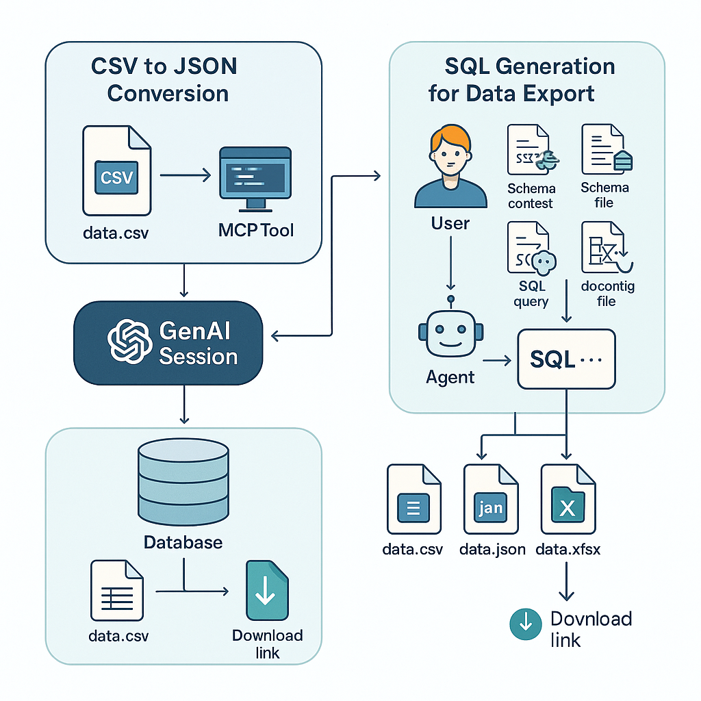

# Golden Sapphire MCP Tools

This project demonstrates how to build and deploy powerful data transformation and export tools using FastMCP and GenAI Session, with support for dynamic file processing, SQL generation from natural language, and secure downloads.

## Features

### ✅ CSV to JSON Conversion Tool
- Accepts an uploaded CSV file.
- Converts content to JSON format.
- Returns a downloadable file link using signed URL.

### ✅ SQL Generation via Agent
- Takes a natural language request, schema context, and schema file.
- Uses a registered agent (`gs_sql_generator`) to convert the request into an SQL query.

### ✅ Data Export Tool (`gs-data-export`)
- Executes SQL on a provided database using `asyncpg`.
- Supports output in **CSV**, **JSON**, and **Excel**.
- Exports results and provides signed download link.

## 📊 Architecture Overview

### ✅ Proxy Download Route
- Secured proxy download route using JWT and HMAC signature with expiry.

## MCP Tool Definitions

### 1. CSV to JSON
- Tool: `csv_to_json(file_id: str)`
- Input: `file_id` (uploaded CSV)
- Output: `JSON file`, preview, and signed download link.

### 2. GS Data Export
- Tool: `gs_data_export(input: GSDataExportInput)`
- Inputs:
  - `schema_context_file_id`
  - `schema_file_id`
  - `db_config_file_id`
  - `request` (Natural Language)
  - `output_format` (csv/json/excel)

## Usage Notes

- Agent `gs_sql_generator` must be registered and deployed via GenAI Agent CLI.
- Tokens (`GENAI_JWT_TOKEN`, `GENAI_API_BASE_URL`) must be set via `.env`.
- File downloads must pass through signed URL proxy: `/proxy/download/{file_id}`

---

## Requirements

See [`requirements.txt`](requirements.txt) for dependencies.
